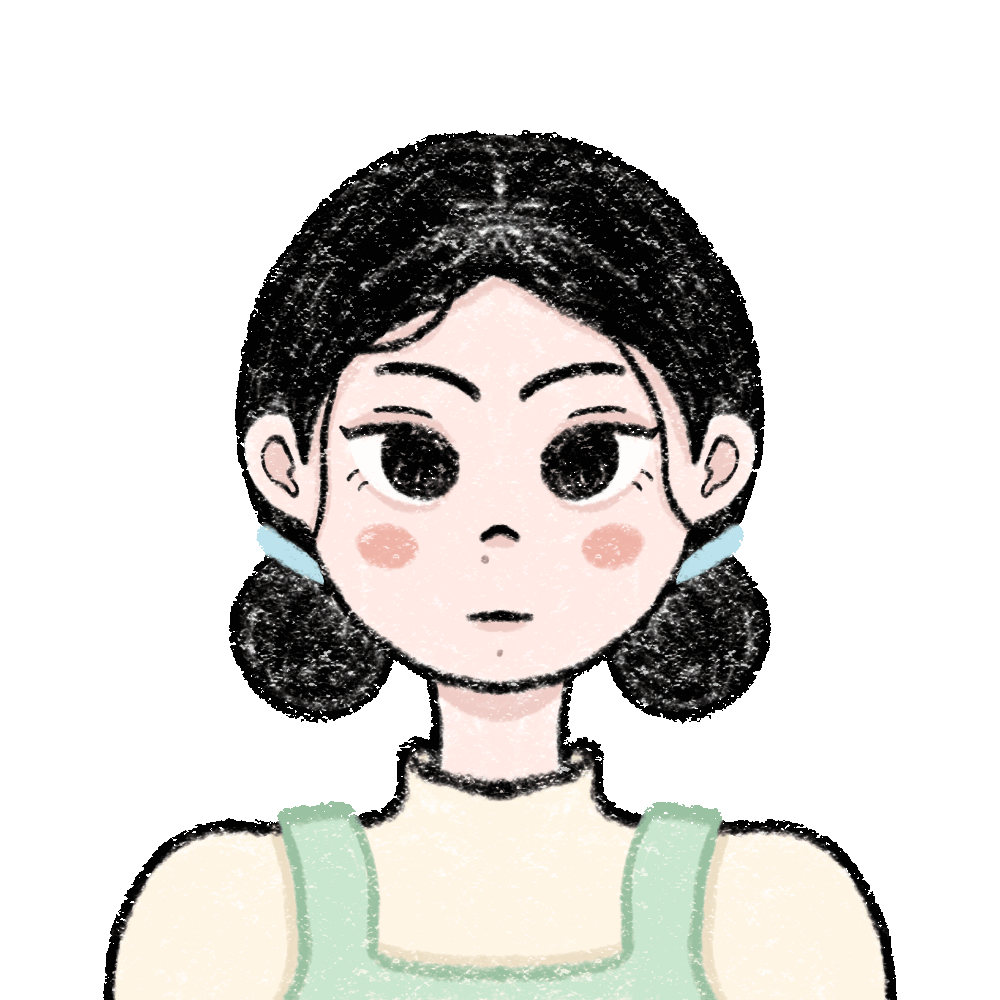

  

  

  

  

## 🌱 About Me

I'm a **BSIT student** passionate about creating **clean, modern, and interactive web experiences**.  
I love building projects that are responsive, playful, and visually soft on the eyes.

* 🔭 Currently working on: **My Portfolio Site**
* 🌱 Currently learning: **Next.js, React, UI/UX Design**
* 💕 I love: **Pastel aesthetics & Minimalist UI**

  

## ☁️ Tech & Tools

  
<b>✨ Click to reveal my stack!</b>

   
  

    
    
    
    
    
    
    
     
    
    
    
    
    
  

  

## 🍧 Featured Projects

<table border="0" align="center">
  <tr>
    <td width="50%" align="center">
      <h3>🌸 Chmera Blog</h3>
      
      
A minimal blog layout with responsive styling and components.

      
    </td>
    <td width="50%" align="center">
      <h3>✨ Chascent Studio</h3>
      
      
Creative portfolio playground with modern design elements.

      
    </td>
  </tr>
</table>

  

## 🍥 Daily Vibe

  

    
<b>✨ Click to reveal your daily inspiration</b>

     
    <table align="center">
      <tr>
        <td align="left" style="border: 2px solid #86B6F6; border-radius: 20px; padding: 25px; background-color: #FDFDFF;">
          <b>Today's Reminders:</b>
            
          
            🌸 <i>"You are a masterpiece in the making, and enough as you are."</i>  
            ☁️ <i>"Be gentle with yourself; you are a garden that needs time to bloom."</i>  
            ✨ <i>"Softness is not weakness; it is the courage to stay open."</i>  
            🌙 <i>"Like the moon, you do not have to be whole to be beautiful."</i>  
            🍵 <i>"Kindness to yourself is the fuel for the dreams you are building."</i>
          
            
          

            ───────────────
          

        </td>
      </tr>
    </table>
  

## 📈 Activity & Achievements

  

  

---

## 📫 Let's Connect!

  
  
  

  

  ｡🌸 Thank you for visiting my profile 🌸｡

