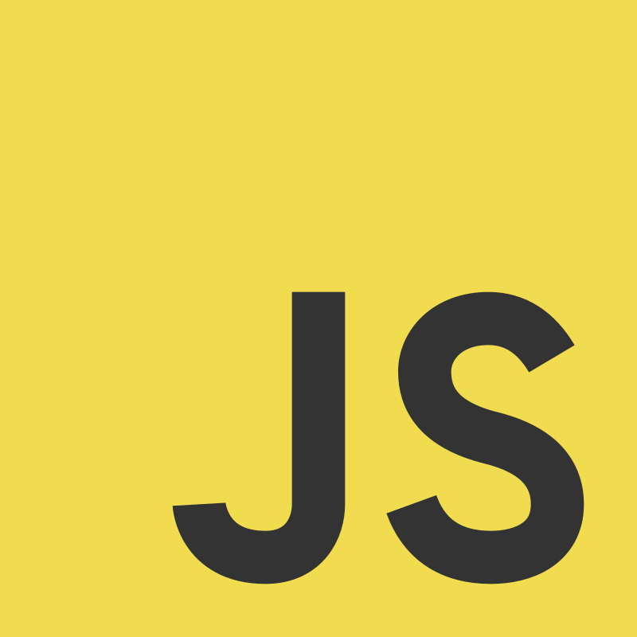

<!-- ANIMATED HEADER -->

  

<!-- MAIN GIF -->

  

Icon by <a href="https://www.flaticon.com/free-icons/rabbit" title="rabbit icons">Rabbit icons by Freepik - Flaticon</a>

---

<!-- ABOUT ME -->
<h2 align="left" style="display: flex; align-items: center; gap: 8px;">
  
  About Me
</h2>

I'm a **BSIT student** passionate about creating **clean, modern, and interactive web experiences**.  
I love building projects that are responsive, playful, and visually soft on the eyes.

- 🌱 Currently learning **HTML**, **CSS**, **JavaScript**, **React**, and **UI/UX design**  
- 🌿 Inspired by **minimalist and pastel-themed web design**  

---

<!-- TECH & TOOLS -->
<h2 align="left">
  
  Tech & Tools
</h2>

Icon by <a href="https://www.flaticon.com/free-icons/technology" title="technology icons">Technology icons by Muhammad Ali - Flaticon</a>

<!-- HTML Badge -->

   HTML

<!-- CSS Badge -->

   CSS

<!-- JavaScript Badge -->

   JavaScript

<!-- React Badge -->

   React

<!-- Bootstrap Badge -->

   Bootstrap

<!-- Tailwind Badge -->

   Tailwind

<!-- Node.js Badge -->

   Node.js

<!-- Git Badge -->

   Git

<!-- GitHub Badge -->

   GitHub

<!-- VSCode Badge -->

   VSCode

<!-- Vite Badge -->

   Vite

Expanding my toolkit & experimenting with modern frameworks ✨

---

<!-- FEATURED PROJECTS -->
<h2 align="left">
  
  Featured Projects
</h2>

  
  
  

---

<!-- GITHUB STATS -->
<h2 align="left">
  
  GitHub Stats
</h2>

  
  

  

---

<!-- CONNECT -->
<h2 align="left">
  
  Let's Connect!
</h2>

  
  
  

---

🌸 Thanks for stopping by! Happy coding 💻✨

